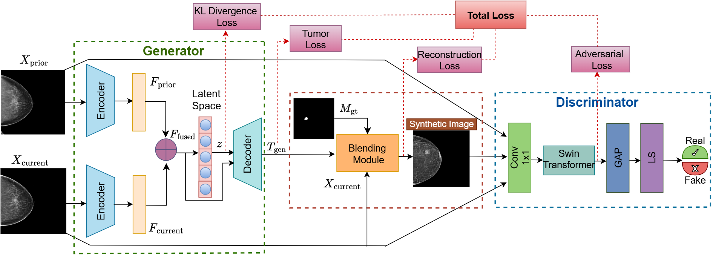

# Overview
This repository contains an implementation of a GAN + Transformer-based architecture for synthesizing tumors in mammograms using prior and current images.
The model uses:

Dual Transformer Encoders

Variational Latent Space

Differentiable Blending Module

Swin Transformer Discriminator

## Model Architecture


## Structure
```
├── dataset.py        # Dataset loader
├── generator.py      # Generator network
├── decoder.py       # Transformer-based decoder
├── encoder.py       # Transformer-based encoder
├── discriminator.py # Swin Transformer discriminator
├── losses.py        # Loss functions
├── logger.py        # Training logger
├── config.py        # Hyperparameters & constants
├── seed.py          # Random seed setup
├── train.py         # Training script
├── test.py          # Testing / inference script
└── README.md        # Project documentation
```

## Setup
```bash
pip install -r requirements.txt
```

## Training
```bash
python train.py
```

## Evaluation
```bash
python test.py

